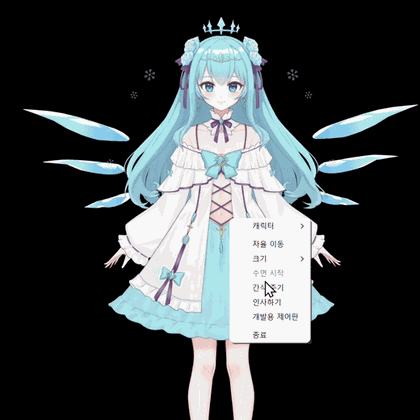
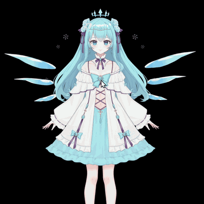

<h1 align="center">Eungjae Kim</h1>

  Soongsil University · AI Software

  AI · Systems

---

## About Me

소프트웨어의 동작 원리를 이해하고 직접 구현하는 과정을 좋아합니다.  
현재 C와 Python을 기반으로 프로그래밍을 공부하며 AI와 시스템 분야를 탐색하고 있습니다.

  <code>Transformer & LLM</code>
  <code>System Programming</code>
  <code>Security</code>
  <code>Interactive Software</code>

---

## Featured Project

### [Live2D Companion Engine](https://github.com/HighKcal/Live2D_Companion_Engine)

**사용자의 행동에 반응하고 상호작용하는 Live2D 데스크톱 캐릭터 엔진**

캐릭터별 설정을 프로필 기반으로 분리하여  
다양한 Live2D 모델에 행동과 상호작용을 적용할 수 있도록 설계했습니다.

`2026.09`

### Interaction Demo

<table>
  <tr>
    <td align="center" width="33%">
      
    </td>
    <td align="center" width="33%">
      
    </td>
    <td align="center" width="33%">
      
    </td>
  </tr>
  <tr>
    <td align="center">
      <b>Contextual Interaction</b> 
      간식(쿠키) 주기
    </td>
    <td align="center">
      <b>Pointer-based Interaction</b> 
      Petting
    </td>
    <td align="center">
      <b>State Transition</b> 
      화남 → 풀림
    </td>
  </tr>
</table>

### Role

`Planning` `UX / Interaction Design` `System Design`

### Stack

`Python` `Live2D` `PySide6` `OpenGL`

> Live2D model used for demonstration purposes only.  
> Model assets are not included in this repository.  
> **Live2D Model:** @TianYeLulu

---

## Tech Stack

  

---

## Currently Exploring

  <code>LLM</code>
  <code>Transformer</code>
  <code>System Programming</code>
  <code>Security</code>

